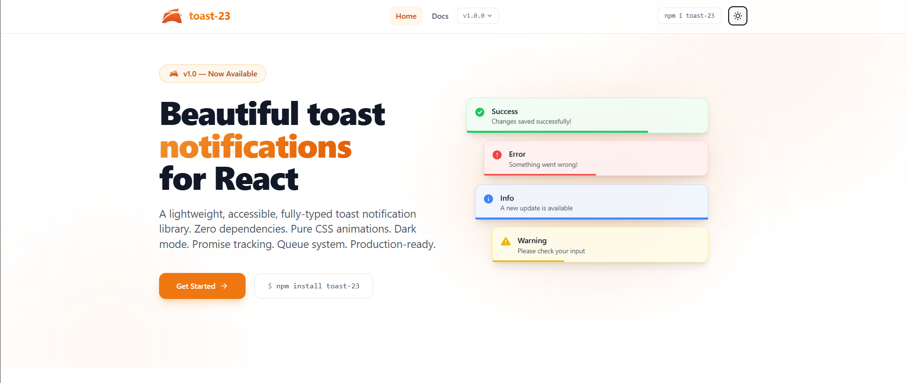

<div align="center">
<div style= "position: relative; display:inline-block; max-width:100%;">
 

  </div>
  <br/>
  <div align="center" >
  
  <span 
    style="
      font-size: 28px; 
      font-weight: 700; 
      margin-left: 12px; 
      vertical-align: middle;
    "
  >
    toast-23
  </span>

</div>


**A lightweight, accessible, fully-typed React toast notification library.**

Zero runtime dependencies · CSS animations · Dark mode · Promise tracking · Queue system

[](https://www.npmjs.com/package/toast-23)
[](https://bundlephobia.com/package/toast-23)
[](./LICENSE)

</div>
<br/>
<div align="center">
<a href="https:///">Website</a> 
<span> · </span>
<a href="https:///docs">Documentation</a> 
<!-- <span> · </span>
<a href="https://twitter.com/">Twitter</a> -->
</div>

<br />
<div align="center">
  <sub>Made by <a href="https://github.com/Its-sultan">Thabit S</a> 🧑🏽‍💻</sub>
</div>
<br/>

---

## Features

- 🎨 **5 variants** — success, error, warning, info, default
- 📍 **6 positions** — top-right, top-left, top-center, bottom-right, bottom-left, bottom-center
- ⏳ **Promise API** — track async operations with loading → success / error
- ⏳ **Loading toast** — `toast.loading()` with manual update
- 🧩 **Custom JSX** — `toast.custom()` for fully custom content
- 🔄 **Update & Deduplicate** — update existing toasts via `id`, prevent duplicates
- 📦 **Queue system** — configurable max visible toasts with +N badge
- 🧹 **Dismiss & Remove** — dismiss all, remove instantly, configurable `removeDelay`
- 🌙 **Dark mode** — automatic (`prefers-color-scheme`) + manual (`.dark` class)
- ♿ **Accessible** — ARIA live regions, keyboard-navigable dismiss
- 🎭 **CSS animations** — smooth enter/exit transitions, hover-pause with progress reversal
- 🪶 **Lightweight** — zero runtime dependencies beyond React
- 🔒 **Fully typed** — complete TypeScript API
- 🌲 **Tree-shakeable** — ESM + CJS dual output
- 🌐 **Standalone API** — `createToast23()` for Angular, Vue, Svelte, vanilla JS

---

## Installation

#### With npm

```bash
npm install toast-23
```

#### With yarn

```bash
yarn add toast-23
```

#### With pnpm

```bash
pnpm add toast-23
```

---

## Quick Start

### 1. Import the stylesheet

```tsx
// In your app entry (e.g., main.tsx or layout.tsx)
import "toast-23/styles.css";
```

### 2. Wrap your app with the provider

```tsx
import { Toast23Provider } from "toast-23";

function App() {
  return (
    <Toast23Provider position="top-right" maxVisible={5} duration={4000}>
      <YourApp />
    </Toast23Provider>
  );
}
```

### 3. Use the hook

```tsx
import { useToast } from "toast-23";

function MyComponent() {
  const toast = useToast();

  return (
    <div>
      <button onClick={() => toast("Hello world!")}>Default</button>
      <button onClick={() => toast.success("Saved successfully!")}>
        Success
      </button>
      <button onClick={() => toast.error("Something went wrong")}>Error</button>
      <button onClick={() => toast.warning("Please check your input")}>
        Warning
      </button>
      <button onClick={() => toast.info("New update available")}>Info</button>
    </div>
  );
}
```

---

## Documentation

Find the full API reference on [official documentation]()

## Testing

toast-23 uses [Vitest](https://vitest.dev/) with [Testing Library](https://testing-library.com/):

```bash
# Run tests
npm test

# Watch mode
npm run test:watch

# Coverage
npm run test:coverage
```

---

## CI/CD

GitHub Actions workflow at `.github/workflows/ci.yml`:

- **Lint** — TypeScript type checking
- **Test** — Vitest test suite (Node 18, 20, 22)
- **Build** — Vite library build with DTS generation
- **Publish** — Auto-publish to npm on version bump (requires `NPM_TOKEN` secret)

---

## Suggested Improvements for v2

- [ ] Swipe-to-dismiss on mobile
- [ ] Stacked/collapsed mode for overflow
- [ ] Undo action support
- [ ] Theming via CSS custom properties (design tokens)
- [ ] Headless mode (bring your own UI)
- [ ] Rich content: icons, avatars, action buttons
- [ ] Sound notifications
- [ ] Persistent toasts (survive page navigation)

---

## License

MIT © toast-23 contributors
